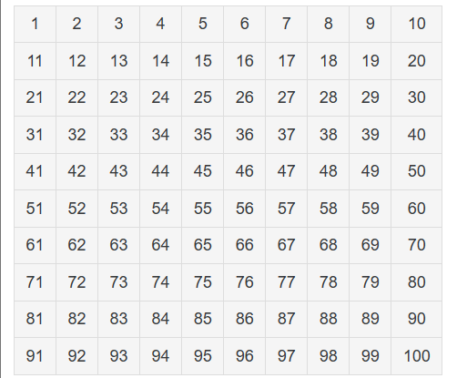
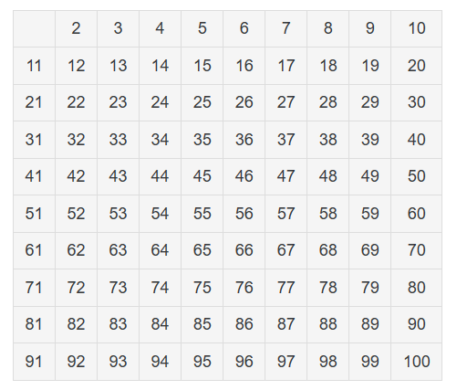
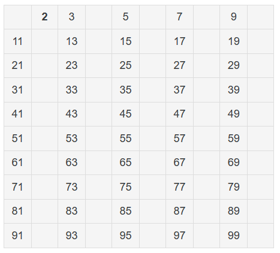
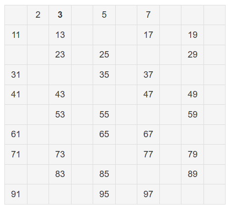
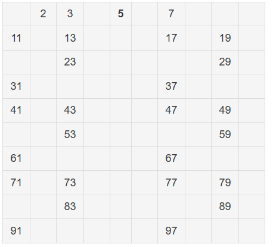
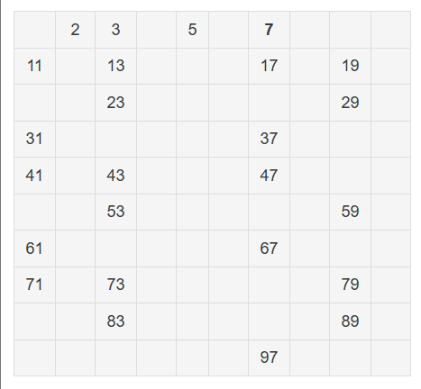
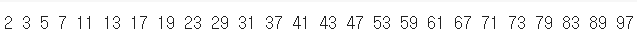

이번 포스팅에서는 에라토스테네스의 체에 대해서 알아보겠습니다.  

# 1.에라토스테네스의 체란 (Sieve of Eratosthenes)?  
## ***정의***    
: 고대 그리스의 수학자 에라토스테네스가 만들어 낸 소수를 찾는 방법.   
  이 방법은 마치 체로 치듯이 수를 걸러낸다고 하여 '에라토스테네스의 체'라고 부른다. 

# 2.방법  

임의의 자연수 n에 대해 그 이하의 소수를 모두 찾는, 가장 간단하고 빠른방법이다. 예를 들어 1~100까지 숫자 중 소수를 찾는다 하자.

- 일단 1부터 100까지 숫자를 쭉 쓴다.
  

- 그 다음 소수도, 합성수도 아닌 유일한 자연수 1을 제거한다.
  

- 2를 제외한 2의 배수를 제거한다.  
  

- 3을 제외한 3의 배수를 제거한다.  
  

- 4의 배수를 지울 필요는 없다(2의 배수에서 이미 지워졌기 때문에) 그렇다면 2, 3 다음으로 남아 있는 소수 중 가장 작은 5를 제외한 5의 배수를 제거한다.  
  

- 마지막으로는 7을 제외한 7의 배수까지 제거하면 된다.  
  

8의 배수는 지울 필요 없다.(2의 배수에서 이미 지워졌다.[A]) 9의 배수도 지울 필요 없다.(3의 배수에서 이미 지워졌다.[A]) 10의 배수도 지울 필요 없다.(2의 배수에서 이미 지워졌다.[A]) 그리고 11 이상의 소수들의 배수부터는 11 > 루트100
이기 때문에 역시 지울 필요 없다.(100 이하 자연수 중에서 11의 배수는 11에 1~9사이의 값을 곱한 것인데 모두 1~9사이의 배수이다.)  

# 3.장점  
- 1부터 100까지의 수를 정말 쉬운 구구단 만으로 소수를 쉽게 빠르게 구할 수 있다.  

# 4.소스코드  

  
  

